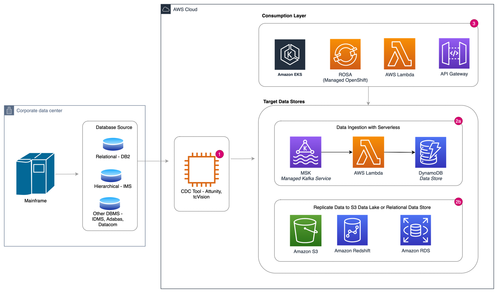

# Mainframe Modernization 

## Overview

> From booking and purchase travel to financial transactions, inventory
> control to payroll, mainframe underpins many mission-critical
> applications for enterprises, and continue to have a place in highly
> specific scenarios, such as extreme-volume, transaction-intensive,
> high throughput IT environments. However, high cost, lack of agility,
> monolithic architecture, and talent gaps are key challenges in
> maintaining status-quo.

## Key Challenges of Mainframe Replacement

> Mainframe-to-cloud migration or mainframe replacement is not an easy
> option for organizations that can't afford downtime or errors and rely
> on mainframe extreme throughput.
> 
> The first challenges are technical, as full rewrite of mainframe
> applications are complex and time consuming (millions of lines of
> code, decades of patches applied, little or no documentation).
> 
> There are commercial challenges as well, significant investment needed
> due to lengthy processes and resource intensive effort. This can make
> it difficult to forecast exact investment required.
> 
> Lastly, there are missing mainframe apps experts and insufficient
> skills of migration/transformation solutions.

## Mainframe modernization

> Many large, established companies, especially in financial services,
> travel, insurance will continue to rely on mainframe to provide
> reliable, robust, and highly available platform for their most
> critical applications and data. Many of the same organizations are
> also looking to modernize their data infrastructure, and architecture
> including cloud migration, moving from monolithic applications to
> microservices and embracing open systems. These data-driven
> enterprises need to combine data from mainframe with data across the
> rest-off the organization in real-time to use all their data for the
> competitive advantage. Mainframe data stores often hold large amounts
> of complex and critical data in a proprietary legacy format, making
> this data difficult to extract and inconsistent with modern databases,
> data types and data tools. Mainframe offloading provides a path
> forward for the organizations to unlock the value of mainframe data in
> the modernization journey. Offloading data from the mainframe will
> decouple applications from mainframe and lower operational expenses by
> reducing MIPS (million instructions per second)[^1]. Less MIPS, less
> cost. This allows to build new innovative applications because
> creating high load and cost of direct mainframe access were the main
> blockers to release new capabilities on mainframe.

## Mainframe offloading to build cloud native architecture on AWS

> In this solution overview, we will discuss some patterns to integrate
> with mainframe data to build microservice-oriented, event streaming
> application with Kafka and Kubernetes at its core as well as making
> data available for latest cloud services such as analytics, and
> machine learning (ML).
>
> Typically, mainframe data sources include data files like VSAM and/or
> more common relational database, such as IBM DB2, or non-relational
> databases IMS/DB. Or, many mature mainframes shop already have legacy
> message-oriented integration tools, such as an Enterprise Service Bus
> or IBM MQ. Based on the mainframe data source, you can choose one of
> the following integration patterns:

-   Event sourcing integration for legacy middleware

-   File based integration for file data

-   Change Data Capture (CDC) for database data

#### 

#### Event sourcing integration for legacy middleware

> In the scenarios where message-oriented middleware (MOM) systems such
> as IBM MQ or TIBCO Enterprise Messaging Service (EMS) are already
> running and integrated with mainframe, you cannot simply turn MOM off,
> or cut it out and replace it. Therefore, leverage existing MQ and
> Enterprise Service Bus (ESB) solutions to integrate with cloud-based
> streaming and messaging services. These act as a buffer to keep data
> in sync. Use cases include:

-   Build new capabilities and enable new communication channels on
    cloud. Examples are mobile applications, innovations based on big
    data analytics or machine learning.

-   Migrate the producer and consumer applications communicating with
    on-premises legacy integration platforms to AWS with an end goal to
    decommission on-premises MOM platform.

*figure 1. MOM based integration*

##### Workflow

1.  Mainframe transactions from MQ or ESB can be read using an
    open-source Kafka source connector for MQ or other messaging
    platform. Amazon Managed Streaming for Kafka (MSK) Connect service
    provides the infrastructure to run the connector plug-ins. The
    messages can then be published to MSK topics or any queue-based
    services like RabbitMQ or Amazon MQ.

2.  After the data is available in the Kafka topic, stream processing
    microservice deployed on RedHat Open Shift on AWS (ROSA) or any
    other compute services (EKS, Lambda) processes, map, transform, or
    filter the messages. These stream handlers can store the data in any
    of the data platform services like DynamoDB, ElastiCache, or RDS.

3.  Now that the data resides in AWS, you can build cloud-native
    applications. Build new GraphQL APIs on AWS AppSync for the Single
    Page App (SPA) or mobile app, or to monetize API. AWS AppSync has a
    subscription feature to extend the events all the way to the
    browser.

4.  Build resilient systems and reduce latency while increasing
    availability by deploying in multiple AWS regions, with
    active/active real-time synchronization supported by DynamoDB and
    Kafka.

#### File based integration for file data

> This integration scenario is useful in the following use cases:

-   Analyzing current and historical mainframe data to enhance business
    analytics.

-   Providing mainframe applications data for downstream dependent
    systems running on AWS

f*igure 2. File based integration*

##### Workflow

1.  **Data Ingestion.** In this example, the data files are ingested to
    AWS using an AWS Partner mainframe integration solution like
    tcVision. This service supports CDC from variety of mainframe-based
    databases and data files. Examples include Db2, IMS/DB, ADABAS,
    Datacom, IDMS, VSAM files, and so on. tcVision Manager running on
    EC2 acts as a replication server. This server contains utilities for
    automatic data mapping to generate metadata for sources and targets.
    It extracts the data from the source, handles data type conversion
    issues, such as EBCDIC to ASCII, transforms, and processes the data
    for the target systems and writes the data into the targets.

2.  **Bulk Load**. tcVision's bulk load performs the initial target data
    store, Amazon S3, load using mainframe source data. Source data can
    be read directly from the mainframe data store or can be read from a
    mainframe backup or unload. The bulk load provides automatic
    translation of mainframe data types such as EBCDIC packed fields.

3.  **Data transformation**. Before moving data to AWS data platform,
    transformation of the data may be necessary to use it for analytics.
    AWS analytic services like AWS Lambda, or Apache Spark on Amazon
    Elastic Map Reduce (EMR) or a custom Spring Boot application running
    on Amazon Kubernetes platform (EKS) can be used to perform these
    transformations.

4.  **Data store**. Data is transformed into a consumable format that
    can be stored in a Data Lake solution build on Amazon S3.

5.  **Data consumption**. Use analytics service like Amazon Athena or
    Amazon Redshift for complex reporting and aggregations.

6.  **Real-Time Replication**. tcVision CDC enables direct streaming of
    the changed data from VSAM files into Kafka or other streaming
    platform like AWS Kinesis. tcVision utilizes native logging
    associated with each mainframe database to capture the data changes
    on the mainframe platform. This includes adds, updates, and deletes
    to specific data records. These events are then processed by the
    event consumer apps on AWS Lambda or a custom solution running on
    OpenShift/Kubernetes service to load into DynamoDB or other data
    services.

#### 

#### Change Data Capture (CDC) for database data

> This is most common option for mainframe offloading. CDC for
> near-real-time replication works by capturing change log activity to
> drive changes in the target dataset. Use cases include:

-   To build agile services in the cloud for retrieve functions.

-   Phased modernization for on-prem tightly coupled applications.

-   Real-time analytics

*figure 3. Transaction based integration*

1.  3rd party commercial CDC solutions, such as Attunity, tcVision can
    be used to facilitate real-time data movement between mainframe and
    AWS. On the first connection, the CDC tools reads a consistent
    snapshot of all the tables that are whitelisted. When that snapshot
    is complete, the connector continuously streams the changes that
    were committed to the DB2 database for all whitelisted tables in
    capture mode. This generates corresponding insert, update, and
    delete events.

2.  Use a fan-out pattern to read once from mainframe to reduce the
    processing requirements and replicate data to multiple data stores
    based on the use case.

    a.  For low latency requirements, record all the events for each
        table in a separate Kafka topic on Amazon Managed Stream for
        Kafka (MSK) cluster and use AWS Lambda or other compute services
        to store in Amazon DynamoDB., where they can be easily consumed
        by applications and services.

    b.  For critical business functionality with complex logic, use
        Amazon Aurora or Amazon RDS as targets. Or use Amazon S3 as a
        target to build data lake or for batch processing.

3.  Once the data is in AWS, build flexible, scalable microservices on
    Kubernetes/OpenShift for retrieve and read-only functions.

#### Conclusion

> Mainframe offloading liberates data from mainframe and enables to take
> advantage of the latest cloud services, such as analytics, artificial
> intelligence (AI), scalable storage, modern database, new architecture
> style build on open systems without disrupting the existing critical
> work on the legacy system.

[^1]: MIPS is a way to measure the cost of computing on mainframe
